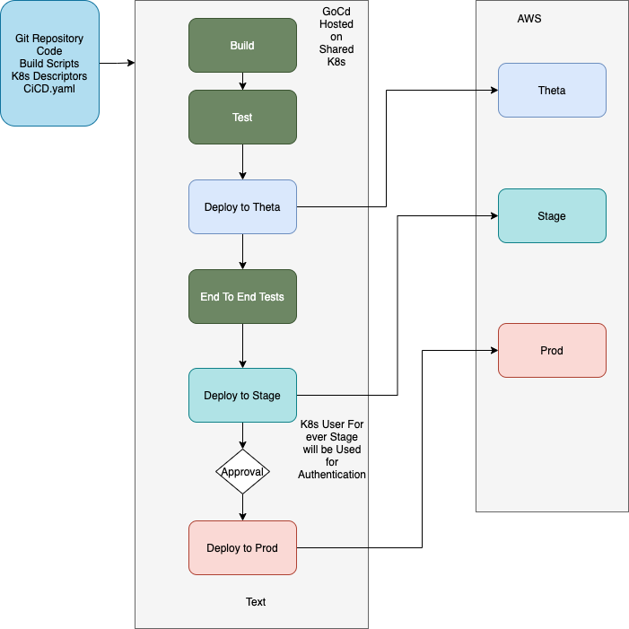

# hack-week-gitops

This repo holds the sample app with the attempt of implementing a better GitOps workflow at SumUp.

## Problem statement

We are trying to answer some simple questions about an application with a singular source of truth like:

1. If I pick up a commit hash/jira ticket , can we know when was it exactly deployed to dev/stage/prod.
2. What was the version/hash which was deployed for my application when a particular incident happened.

What If I tell you it's all possible in a single view with only one tool (don't worry we won't spend money, lot of open source tools can help us and we plan to use GoCD)?

As of now in SumUp we use a tool called ArgoCD for deployment, every stage of the application is represented as a separate application and we don't have a visual graph of what was synced to the Kubernetes cluster at what point of time which makes us lose visibility in a single application.

Why do I need to do an extra commit to deploy-infra when my application repo is separate and should contain everything related to my application like helm charts, configs etc (of course no secrets)

Also, there is no way to validate that a build will be taken to production only if the build passes on Theta or Stage. As of now I can just go and change the tags in the production application without deploying it to stage or Theta(or without any approvals).

If I have to find which version was deployed to which environment at what point in time, It will not take less than 15 mins to get the data across various git repositories and multiple CI/CD tools to find the answer.

What we are trying to do here is give a simplified vision into this question with a singular application/tool.

*Impact*: Continuous deployments/Delivery will be improved

*Theme*: Tech, Infrastructure & Tools

## Initial idea 

Proposition by Sahil.

We will be using GoCd to demonstrate the Trunk Based GitOps CI/CD integration. The service Github repository will be the single source of the truth for each CI/CD action taken.

In GoCD , we will have the material (any repository is called material in GoCd) setup and pointing to the github repository for the service. We will create a single endpoint like health check endpoint based service to demonstrate the project. We will have a pipeline in GoCD setup in such a way that every commit to the repository will be used to trigger the build.

In GoCD we have Stages, Jobs and Commands. Stage consists of multiple jobs and Jobs consist of multiple commands. Stages will be -> Build -> Test -> Deploy to Theta ->End To End Tests -> Deploy to Stage -> Deploy to Prod. To take the build , GoCD needs us to manually click the approval/promote button to push the build or we can set it up automatically. We will deploy to Theta on every commit and then if the End to End test pass we will deploy to stage. For production we will keep the manual push possibility.

We will create a user in AWS which will have access to kubernetes Cluster to apply the descriptors. We will be using GoFmt rather than helm to have capabilities of programmable K8s descriptors.

